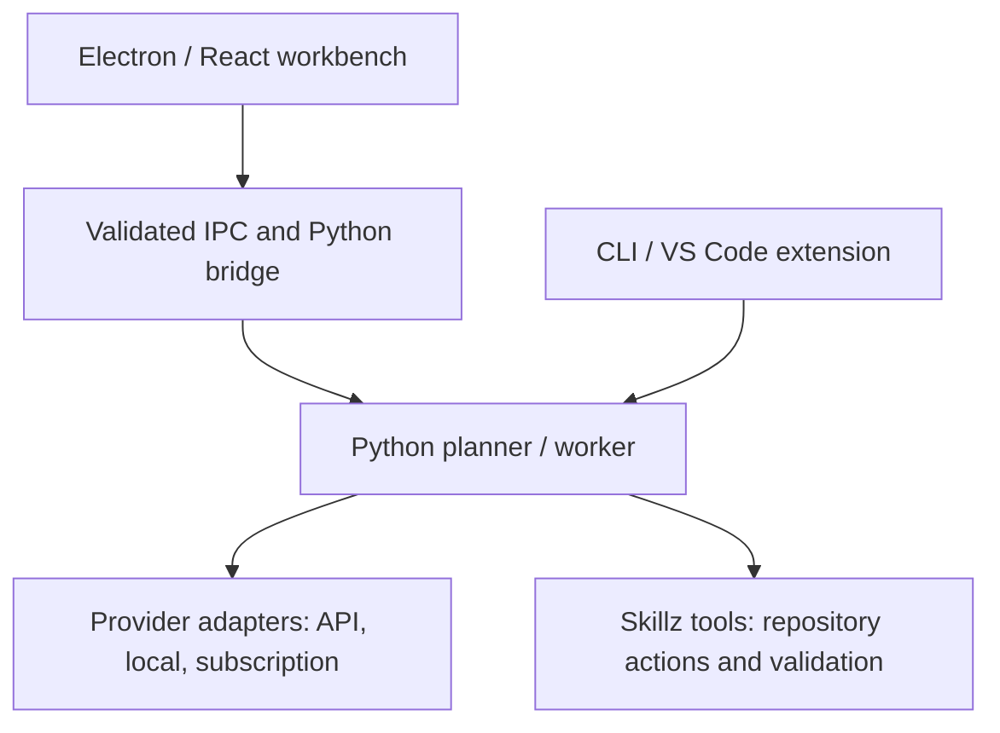

# Skillz Code Agent

Turn a coding request into a reviewable plan, verified repository changes, and a clear record of the work.

[](.github/workflows/prebuilt-artifacts.yml)


[](LICENSE)

[Getting started](#getting-started) · [Usage](#usage) · [Artifacts](#artifacts-and-git-portability) · [Development](#development) · [Documentation](#documentation)

## Overview

Skillz is a planner-first coding agent for developers working in real Git repositories. It clarifies a request, performs bounded discovery, proposes a plan for review, then runs repository actions and validation through its Python host.

The **Electron/React workbench** is the primary desktop interface: an editor, terminal, source control, agent conversation, and issue history in one application. The CLI shares the same backend. A transitional VS Code extension remains available, while ongoing desktop development centers on the standalone workbench.

## Key features

- **Review before execution:** bounded discovery, explicit plan approval, stable and beta/live workers, and recovery from interrupted goals.
- **Choice of model provider:** API providers, local endpoints, and an optional local Codex/ChatGPT subscription runtime.
- **A complete repository workspace:** Monaco editing and diffs, a native terminal, Git controls, clickable file references, diagnostics, issues, and repository facts.
- **Independent artifacts:** React/Express apps with their own Git history, Docker previews and agents, explicit folder grants, and optional chatbots or databases.
- **Reusable service setup:** API Blueprints, a constrained configuration agent, and a Vault that keeps provider keys outside artifact repositories.
- **Portable prebuilt sources:** a publish command that uploads and checks prebuilt histories on the selected remote before publishing the application.

## Getting started

### Prerequisites

| Requirement | When needed |
| --- | --- |
| Python **3.10+**; **3.13** is the documented development target | Python backend and desktop agents |
| Git on `PATH` | Repository operations and prebuilt submodules |
| Node.js **22.12+** and npm | Workbench or extension development |
| Credentials for the chosen provider | API-backed model calls |
| Local Codex CLI and an authenticated session | Only for `codex-subscription` |
| A running **Linux Docker engine** | Artifact previews and artifact agents |

### 1. Clone with the prebuilt sources

```bash
git clone --recurse-submodules https://github.com/arberrexhepi/skillz-code-agent.git
cd skillz-code-agent
```

Already cloned without submodules? Run `npm --prefix desktop run submodules:init` from the repository root.

### 2. Create the Python environment

**macOS / Linux**

```bash
python3 -m venv .venv
.venv/bin/python -m pip install openai google-genai anthropic pytest
cp .env-example .env
```

**Windows PowerShell**

```powershell
py -3 -m venv .venv
.\.venv\Scripts\python.exe -m pip install openai google-genai anthropic pytest
Copy-Item .env-example .env
```

Edit `.env` and set the key for the provider you will use: `OPENAI_API_KEY`, `GEMINI_API_KEY`, `ANTHROPIC_API_KEY`, or `META_AI_API_KEY`. The file is ignored by Git. For `codex-subscription`, select that provider in Runtime settings and complete its sign-in instead of configuring an API key.

### 3. Start the workbench

```bash
npm --prefix desktop install
npm --prefix desktop run dev
```

Open a project folder, open **Runtime**, select the provider, model, and backend, then choose **Start agent**. The workbench discovers the repository virtual environment automatically. Interpreter overrides and Windows/macOS troubleshooting are covered in the [runtime guide](docs/runtime-guide.md#setup) and [desktop guide](desktop/README.md#python-resolution).

## Usage

### Workbench

Submit a concrete request, such as “Add a ten-second countdown before the first drill.” Choose the discovery depth if prompted, review the plan, and approve execution. Follow the resulting changes, diagnostics, and validation report; pause or resume through the agent controls.

An illustrative CLI exchange using the same planner workflow:

```text
planner> Add a ten-second countdown before the first drill.
[Skillz discovers the entry flow and presents a proposed plan.]
planner> approve
[Skillz edits the relevant files, validates the change, and reports the outcome.]
```

### CLI

From the repository root, use the virtual environment for planner mode. Replace `/path/to/project` with the repository to work on, and choose a model available to your provider:

```bash
.venv/bin/python main.py --provider openai --model gpt-5.4 --root /path/to/project
```

On Windows, use `.\.venv\Scripts\python.exe` instead of `.venv/bin/python`. Add `--worker-mode` for direct worker execution, or `--confirm-writes --confirm-shell` for per-action confirmation. `main_v2.py` selects the beta TreeLoop backend; `live_test_loop.py` exposes its live entrypoint.

| Command | Purpose |
| --- | --- |
| `/discover` | Show the pending discovery choice |
| `/plan`, `approve`, `reject` | Inspect or decide on the proposed plan |
| `/providers`, `/models` | Inspect the runtime catalog |
| `/start-auto 3 <request>`, `/stop-auto` | Start or stop continuous issue cycles |
| `/create-issue <details>`, `reopen issue-123` | Create or resume durable work |

See [runtime configuration](docs/runtime-guide.md#run), [agent workflow and tools](docs/agent-workflow.md), and the [VS Code guide](vscode-extension/README.md) for the complete interfaces.

## Architecture and tech stack



| Layer | Main technologies |
| --- | --- |
| Workbench | Electron, React, TypeScript, Vite, Monaco |
| Host integration | Validated IPC, xterm.js, node-pty, Git |
| Agent runtime | Python, planner/worker protocols, provider adapters |
| Artifact apps | React/Vite/TypeScript, Express, Docker |
| Optional artifact data | Sequelize with SQLite, PostgreSQL, MySQL, MariaDB, or SQL Server |

### Runtime boundaries

- The Python host controls repository actions and validation. Model backends return actions for Skillz to validate; the subscription model process does not directly edit the target repository.
- The renderer has no direct Node, filesystem, or process access. Discovery is read-only; mutations and remote writes follow the host’s authorization rules.
- Artifact agents and previews run in Docker with explicit folder grants. **Allow changes** and **Allow Process Proxy** are separate capabilities; approved Process Proxy scripts run with the user’s host privileges.
- Durable `issue-*` records differ from transient `run-*` validation findings. Architecture facts persist across issues; goal facts return with the active or reopened issue.

Read the [runtime boundaries](desktop/README.md#runtime-boundaries), [artifact access model](desktop/README.md#file-access-and-enforcement), and [issue facts guide](docs/agent-workflow.md#issue-scoped-facts) before extending those surfaces.

## Artifacts and Git portability

Use **Artifacts** to build an app or install Server Manager or Repository issue manager. Choose an artifact library, grant only the folders and scripts it needs, and start its agent or preview. Database, chatbot, Blueprint, Vault, dependency repair, and Docker details are in the [Artifacts guide](desktop/README.md#artifacts).

### Cloning and publishing the prebuilt artifacts

The bundled prebuilts are submodules on `prebuilt/server-manager` and `prebuilt/repo-issue-manager`. Their `./` URLs resolve to the cloned repository; the application records exact source commits. Installed copies in a user’s artifact library have independent repositories and publishing configuration.

After pulling, restore the recorded versions. To publish the application and its required prebuilt histories to a configured remote:

```bash
npm --prefix desktop run submodules:init
npm --prefix desktop run repo:publish -- origin
```

Commit child changes and updated parent pointers before publishing. A plain application `git push` bypasses the publisher. The [full prebuilt guide](docs/prebuilt-artifacts.md) covers independent GitHub copies, detached submodule checkouts, second-machine pulls, and destination verification. The [Prebuilt artifacts workflow](.github/workflows/prebuilt-artifacts.yml) should be a required check on protected application branches.

## Development

Run the checks relevant to the code you changed. From the repository root:

```bash
.venv/bin/python -m pytest -q tests
npm --prefix desktop run typecheck
npm --prefix desktop run test:runtime
npm --prefix desktop run test:git
npm --prefix desktop run test:prebuilts
npm --prefix desktop run build
```

On Windows, replace the Python executable with `.\.venv\Scripts\python.exe`. Artifact Docker/browser integration suites are separate; see the [desktop development guide](desktop/README.md#development). Packaging uses `npm --prefix desktop run package`.

## Roadmap and current limitations

- [x] Planner/worker CLI and standalone Electron workbench.
- [x] Independent artifacts, Docker access boundaries, and prebuilt publishing checks.
- [ ] Bundle a platform-specific Python interpreter and provider dependencies with distributable builds.
- [ ] Complete branded installer icons and macOS signing/notarization.
- [ ] Add Language Server Protocol support as a separate main-process service.

Packaged builds currently include the agent source but still require host Python and provider dependencies. The VS Code extension is transitional. See [distribution notes](desktop/README.md#distribution-notes) for the remaining release work.

## Documentation

| Topic | Guide |
| --- | --- |
| Desktop UI, artifacts, permissions, and packaging | [Workbench](desktop/README.md) |
| Setup, providers, model selection, and executable discovery | [Runtime guide](docs/runtime-guide.md) |
| Discovery, approvals, recovery, tools, and issue facts | [Agent workflow](docs/agent-workflow.md) |
| Clones, remotes, submodule changes, and publishing | [Prebuilt artifacts](docs/prebuilt-artifacts.md) |
| Generated dependency notices and release verification | [Third-party licenses](docs/third-party-licenses.md) |
| Detailed implementation updates and compatibility behavior | [Development notes](docs/development-notes.md) |
| Bundled and workspace-local skills | [Skills](skills/README.md) |
| Existing VS Code integration | [Extension](vscode-extension/README.md) |

## License and acknowledgments

Licensed under the [Apache License 2.0](LICENSE).

Copyright 2026 arbër inc. See [NOTICE](NOTICE) for the copyright notice.

Desktop releases include generated third-party license notices and verify them during packaging. See the [third-party license guide](docs/third-party-licenses.md) for coverage and verification commands.

Skillz builds on Electron, React, Vite, TypeScript, Monaco, xterm.js, node-pty, Zod, Express, Sequelize, and the supported provider SDKs. See the [desktop dependencies](desktop/package.json) and [artifact template](desktop/artifact-template/package.json) for their declarations.
